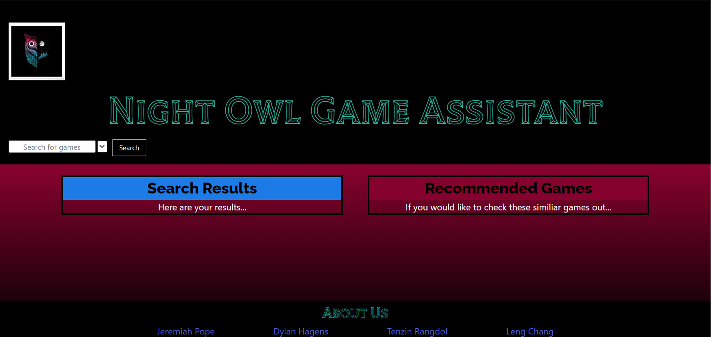

# Night-Owl-Game-Assistant
Website designed to help gamers find new games based on playstyles, preferred types or platform

# User Story

AS A USER...
I WANT to generate reccommended games
SO I can view games that are similiar to what I play.

# Design

SEARCHBOX for specific game titles.
SEARCHBAR that registers and filters for the searched criteria.

DROPDOWN MENU that GETS the following... (maybe multiple DROPDOWN MENUs(?).)
CHECKBOXES for the diverse genres of games.

DISPLAY of game titles in rows/columns
LIGHT/DARK THEME buttons to change the colors.

OTHER games by in this genre/creator.

## Description

This web application is designed to display video game titles that are desired and/or similiar to the searched criteria.

## Usage

Upon opening the application, as the user, you will notice a search bar on the top left of the page. You can input any video game title you want the information to, including which platform(s), and a list of titles will appear along with a list of similiar titles.

## Technologies Used (?)

*(?)*

## Credit

*Image*
*Giant Bomb*
*Open Critic*
*RAWG.IO*

## License

*MIT(?)*